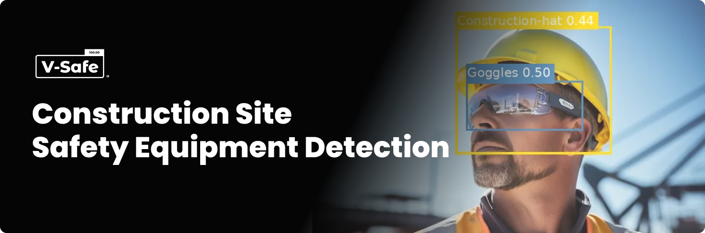
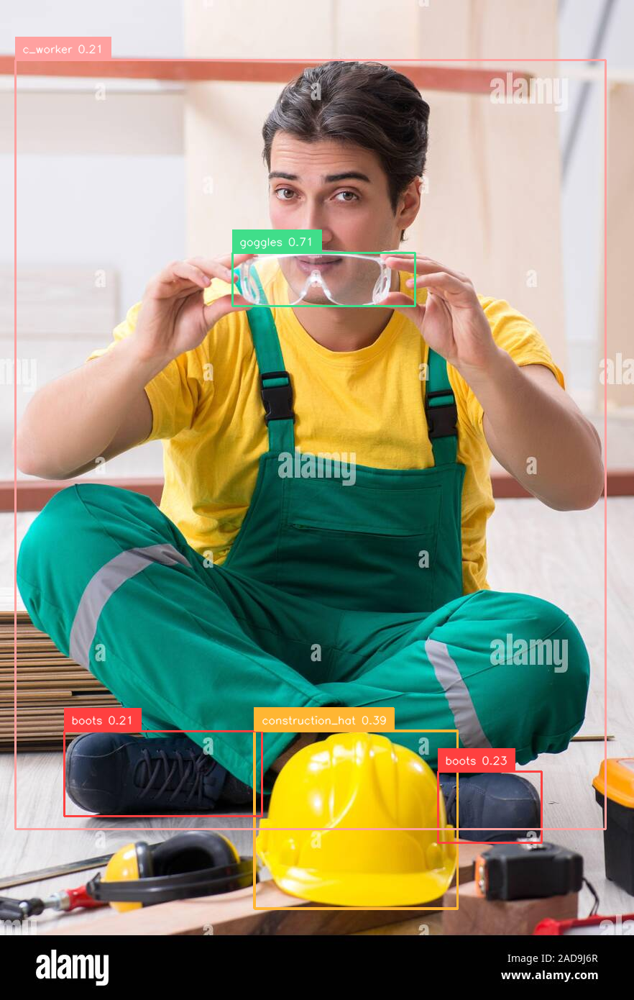

# 

    

## Problem Statement

Safety is a crucial aspect of any construction site. To prevent unexpected incidents or life-threatening accidents, ensuring safety in construction environments is essential. In this project, our goal is to find solutions for enhancing construction safety using computer vision.

We scraped around 10,000 images from the internet, and after cleaning, we used 9,600 images to train multiple object detection models that can identify safety equipment on construction sites.

## The Goals

For this project, our objectives are as follows:

* To detect six safety items — helmet, gloves, mask, safety glasses, safety boots, and vest — along with six other common construction-related objects, including trucks, excavators, cranes, ladders, and workers.
* To train and evaluate different types of object detection models to identify the most effective one for this task.

## Results

We trained three different object detection models and selected **RF-DETR Medium** as the most suitable for our detection task. The model achieved a **Mean Average Precision (mAP@50–95)** score of **0.72**. Below are some annotated results produced by our model.

> **Note:** For detailed performance metrics and annotated results of each model, please refer to the **"Reproduction of this Project"** section.

[https://github.com/user-attachments/assets/076cdad5-4f0a-4ea5-ac20-ae64dc2c3819](https://github.com/user-attachments/assets/076cdad5-4f0a-4ea5-ac20-ae64dc2c3819)

## Reproduction of This Project

In this section, we will provide a step-by-step guide for reproducing this project.

### Workflow

*fig.: High-level overview of the workflow*

 

*fig.: Detailed workflow map*

 

#### Image Scraping & Cleaning

The images were scraped from Google, Bing, and DuckDuckGo using iCrawler and ddgs. We then combined the collected images, removed duplicates, and kept only those in `.jpg` format.
Then, upload the unannotated dataset to Kaggle.

 

> **Note:** You need to set up the Kaggle API key.
>
> * Go to your Kaggle Account Settings → API → Create New API Token.
> * This will download a file named `kaggle.json`.
> * Upload this file to your notebook.
> * Further instructions are provided within the notebook.

 

#### Image Labeling

We used Grounded SAM 2 for automatic image labeling, then uploaded the labeled images to Roboflow.

 

> **Note:** You need a Roboflow account to upload the images.
>
> * Create a Roboflow account.
> * Create a project in your workspace.
> * Click 'Settings' → 'API Key' to get your API.
> * Open your project and check the URL in the browser — it should look like `https://app.roboflow.com/your_workspace_name/your_project_name/other`.
> * Copy your workspace and project name.
> * Further instructions are provided within the notebook.

 

#### Annotation Review

After uploading, review the dataset and remove any mislabeled images. Go to your project in Roboflow and check for incorrect labels.

#### Dataset Creation

* Go to your project on Roboflow.
* Select the 'Version' from the sidebar.
* Select "Create new version".
* Adjust your Train/Test split (we used 78% for training, 20% for validation, and 2% for testing).
* Configure your preprocessing step. (We used Auto-Orient and Resize (fit within 640×640) to reduce training time and improve performance.)
* Set up your data augmentation. (We used Flip (Horizontal, Vertical), 90° Rotate (Clockwise, Counter-Clockwise, Upside Down), Crop (8% Min Zoom, 23% Max Zoom), Rotation (±13°), Shear (±14° Horizontal, ±4° Vertical), Grayscale (7%), Hue (±19°), Saturation (±30%), Brightness (±19%), Exposure (±15%), Blur (Up to 2.6px), and Noise (Up to 1.88%).)
* Click 'Create' and select 'Maximum Version Size' (we used 2×).

#### Dataset Usage

Before using the dataset, ensure it is in the correct format. We used YOLOv11, YOLOv12, and RF-DETR models for training, so we selected:

* 'yolo11 format' for YOLOv11
* 'yolo12 format' for YOLOv12
* 'coco format' for RF-DETR

To download the proper format:

* Click 'Download dataset' and select the format.
* Select 'Show download code', then click "Continue".

> **Note:** You don't need to recreate the dataset for each format — just download the format you need.

 

### Model Training

For this project, we used three models — two from the YOLO family (YOLOv11n & YOLOv12s) and one from the RF-DETR family (RF-DETR Medium). Below are the training notebooks for the models. All models were trained on a T4 GPU on Kaggle.

> **Note:**
>
> * Don't forget to turn on the accelerator from the sidebar.
> * Use 'Save Version' → 'Save & Run All (commit)' to run as a background instance.

 

**YOLOv11n:** We trained this model for 80 epochs. After training, we achieved mAP@50–95 (Mean Average Precision averaged over multiple IoU thresholds) of **0.613**.

 

 

**YOLOv12s:** We trained this model for 65 epochs. After training, we achieved mAP@50–95 of **0.625**.

 

**RF-DETR Medium:** We trained this model for 10 epochs. After training, we achieved mAP@50–95 of **0.72**.

 

### Model Testing & Comparison

The comparison of all models, based on performance on our testing dataset, is provided below.

*fig: Comparison of three models using different metrics.*

*fig: Comparison table for three models across different metrics.*

 

*fig: Confusion matrix for RF-DETR Medium*

 

*fig: Confusion matrix for YOLOv12s*

 

*fig: Confusion matrix for YOLOv11n*

*fig: Inference comparison for three models*

#### Model Selection for Deployment

After testing, we selected **RF-DETR (Medium)** for deployment. As shown in the testing section, this model outperformed both **YOLOv11n** and **YOLOv12s.**

Interestingly, we observed that all models were trained on single-class object instances but evaluated on multi-class predictions. The YOLO models performed poorly when detecting multiple objects in a single image, even with low confidence thresholds. Although we included a few multi-class examples during YOLOv12s training, it was not enough to improve performance.

In contrast, the RF-DETR model — despite being trained on fewer images and without image augmentation (due to limited VRAM) — showed a significant improvement in detecting multiple classes within a single image. We suspect that the model’s architecture played a crucial role in this outcome.

While the inference speed of YOLO models was notably faster, we believe RF-DETR’s inference performance can be improved by using a larger batch size during video-based inference.

### Model Conversion

The model’s PyTorch checkpoint was converted to ONNX format using FP32 precision and a static input shape.
Both the ONNX model and the checkpoint have been uploaded to the <a href="https://huggingface.co/hasnatz/v-safe-rf-detr">Hugging Face model hub</a>.

## Model Deployment

We deployed the model on <a href='https://huggingface.co/spaces/hasnatz/v-safe-demo'>Hugging Face Space</a>.
The implementation can be found there and in the `Deployment` folder.

  

## API Integration with GitHub Pages

The deployed model API has been integrated with our <a href='https://hasnathridoy.github.io/construction-safety-detection/'>GitHub Pages website</a>.
Implementation details are available in the `docs` folder.

## Limitations & Future Updates

While the deployed model performs strongly on close objects, its accuracy decreases for small or distant objects. Additionally, multi-object detection remains a challenge. Future work will focus on addressing these limitations.

**We warmly welcome your contributions to this project!**

